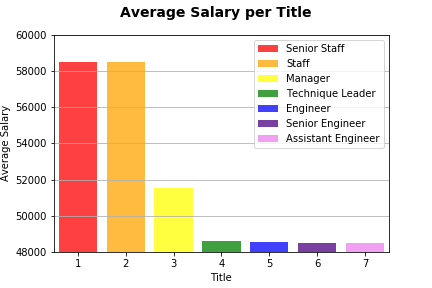
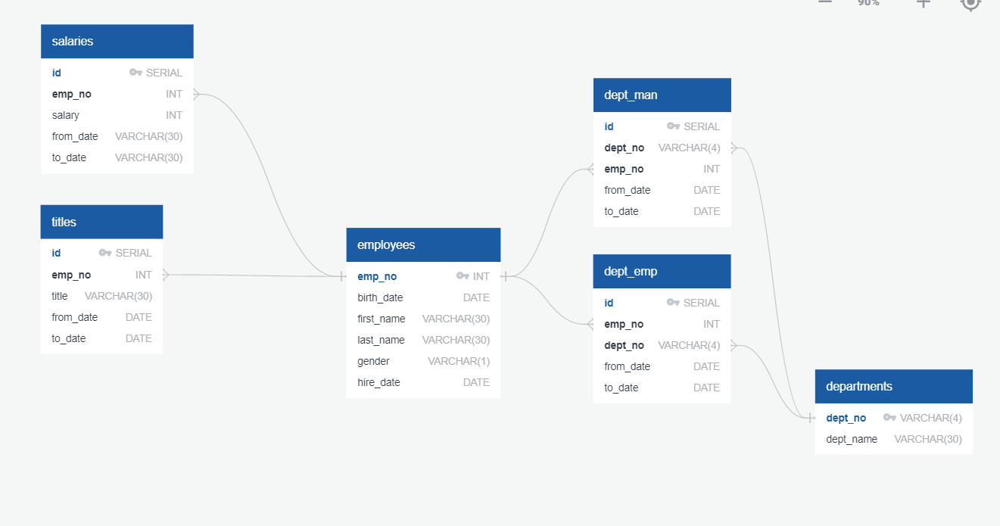

# SQL-Challenge
Week 9 SQL Homework

Employee 499942 is a Technique Leader, who makes $40000 a year and is named: APRIL FOOLSDAY!!!

Which is obvious, seeing the following data analysis employee 499942 completed.
Staff is making far more money on average than managers are! None of this makes sense

The table scheme is as follows:

